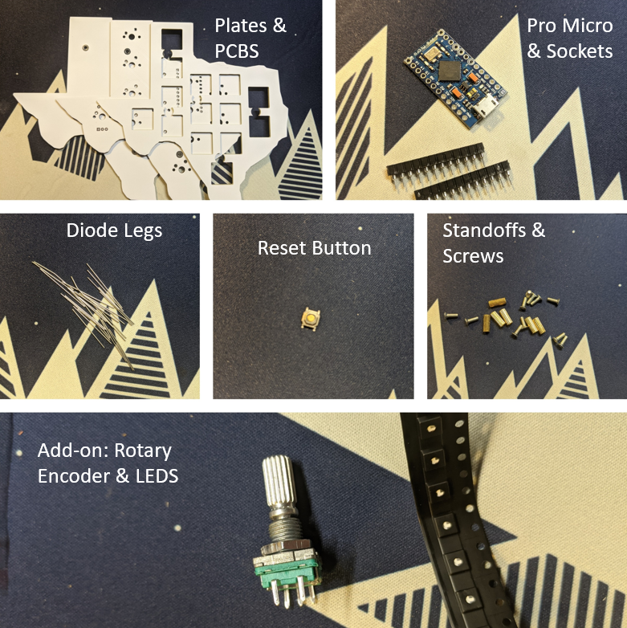
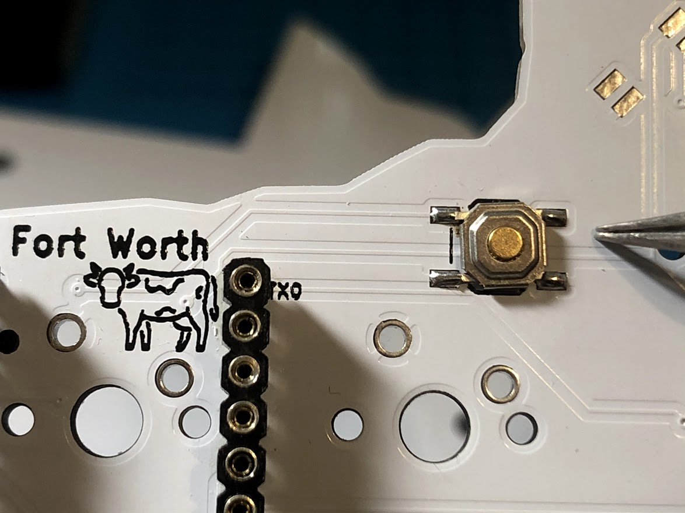
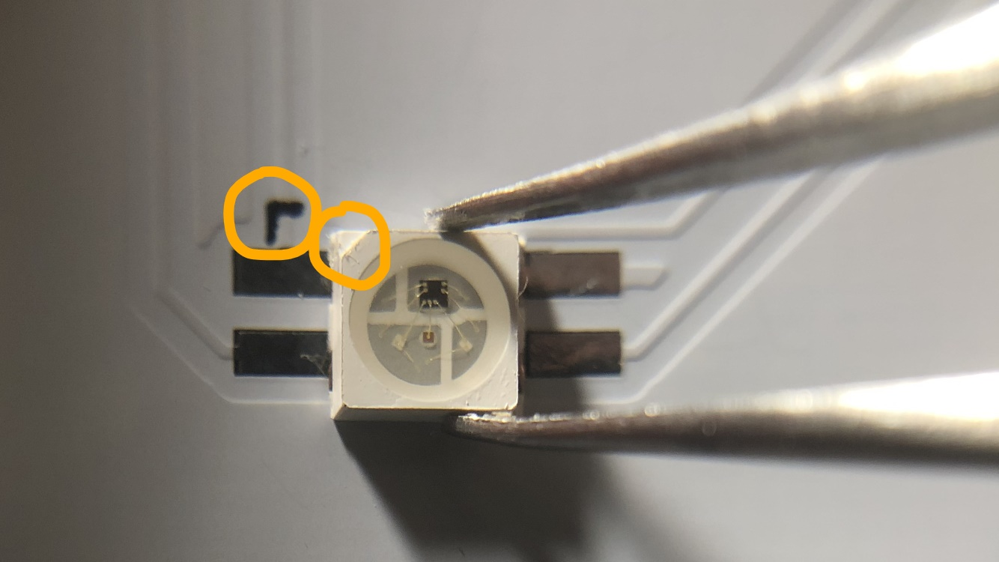
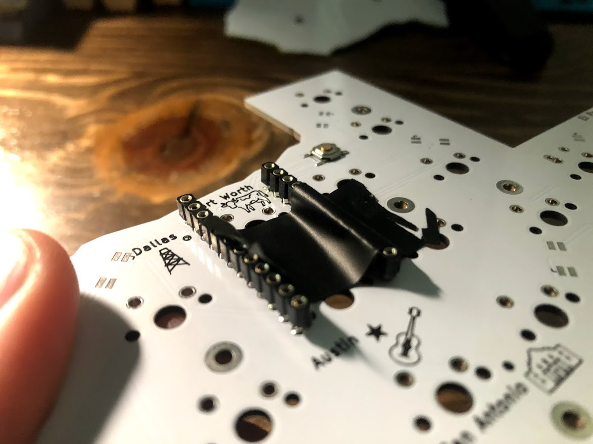
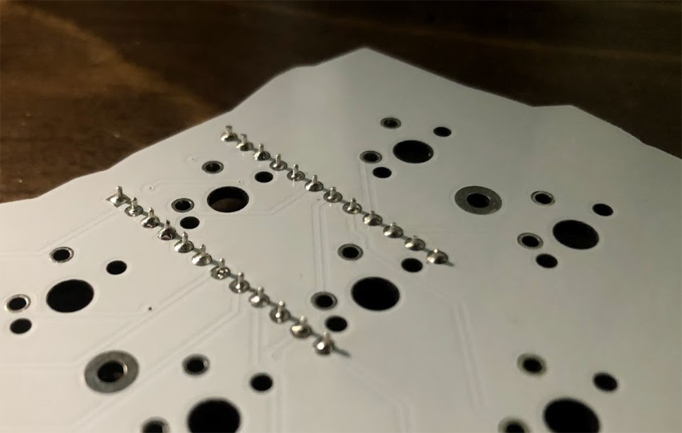
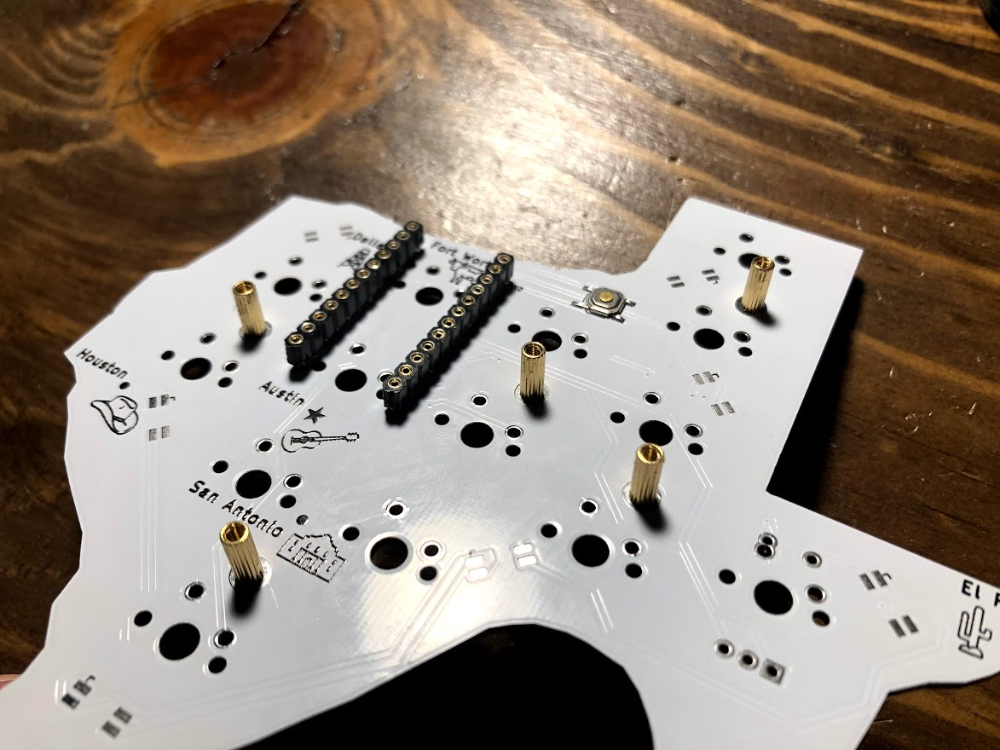
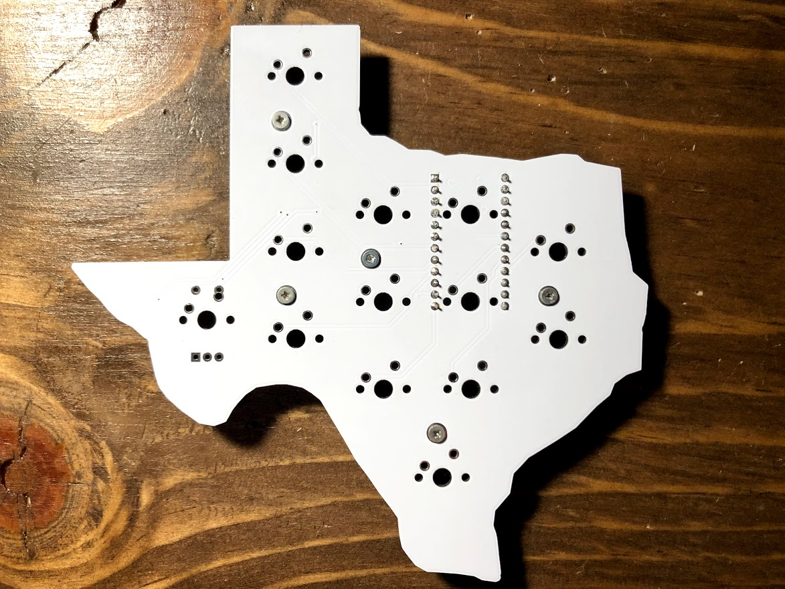
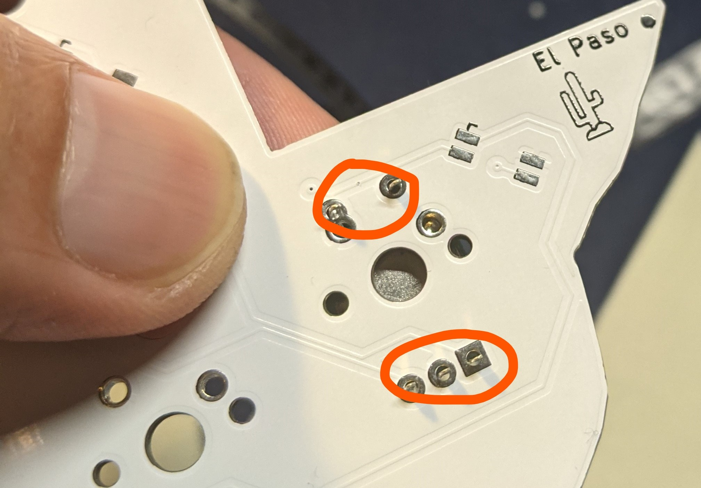
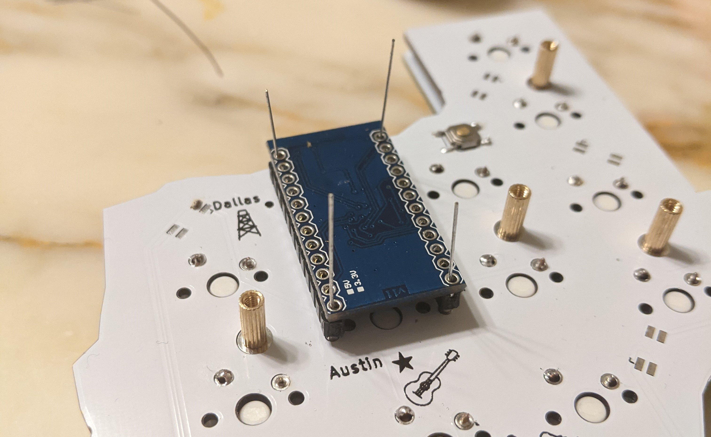
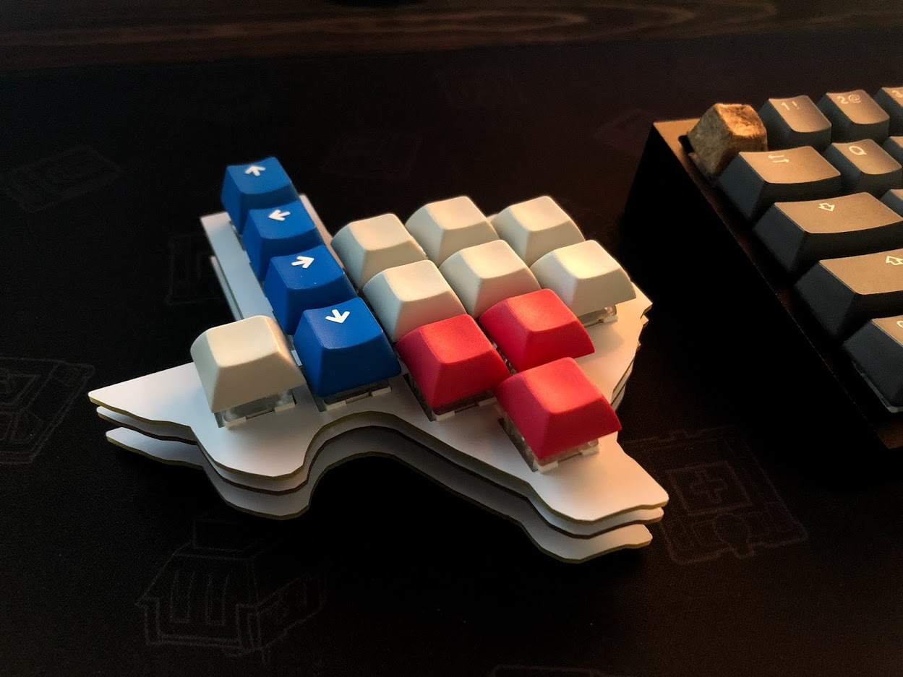

# **Yee-Haw Macro Pad Build Guide**

## Parts:

Included in the base kit should be, 

- 3 Plates (Switch-plate, PCB, Backplate) 
- Pro Micro 
- 2x 12 Sockets for Pro Micro	 
- 24x Diode Legs 

- Reset Button 
- 5x 9mm Brass Standoffs 
- 10x M2 Screws 
- 5x Rubber Bumpons 

And in the addon kit, 

- 7 SK6812 MINI RGB LEDS 
- EC11 Rotary Encoder

You will need the following equipment to assemble and complete the macro pad:

- Solder and soldering Iron
- Flux (highly recommended for LEDs)
- Switches, keycaps, and a Micro USB cable
- Tweezers with fine tip (highly recommended)
- Flush cutters or nail clippers (recommended)
- Electrical or regular tape (recommended)

## Step 1:Solder the reset button

The reset button is located near the top of the PCB, to the right of Fort Worth (see picture below).  Notice that there is a mark on the PCB showing where it should be.

## Step 2: Solder the RGB LEDs (Optional)

If you purchase the addon kit and would like to install LEDs, it will be easier to solder them now when the PCB can still be laid flat. If you have not soldered small components before, this step could be challenging.

If you decide to do so, note that **the RGB do have polarity, and the corner cutout on the LED needs to match the corner marked in black on the each of the LED footprints on the PCB (see the picture below).** To solder the RGB LED, add a small amount of solder to one pad, place the LED, and reheat the pad while stabilizing with tweezers until a connection is made between the LED and the pad on the PCB. It is a good idea to use flux for these. 

## Step 3: Solder the Sockets

The next step is to solder the sockets to the PCB, where the pro micro will sit in. The sockets will hold the pro micro without the pro micro being soldered to the PCB or sockets, making it easy to switch out the pro micro controller if necessary. Start by placing the first set of 12 sockets into the PCB with the plastic part of the socket **on the back side of the PCB** (The side with the pictures and cities, see the picture below.) **Notice that the black plastic part will not be flush with the PCB.** Now use some (electrical) tape to secure the sockets to the board then flip the board over. Solder one pin of the socket, then remove the electrical tape. You can now reheat that joint if necessary, to make the socket straight up and down. Now finish soldering the other 11 pins and repeat for the second set of sockets. 

**If these sockets are not straight, you may have problem sitting the pro micro on top of them**

**You will solder on the top side of the PCB once the electrical tape stabilizes the sockets.**

## Step 4: Set up the Standoffs (No Soldering)

Put screws through the top of the PCB and hand tighten the standoffs to the screws on the bottom of the PCB. 

**The bottom of the PCB should look like this:**

**The top of the PCB should look like this:**

## Step 5: Soldering the Rotary Encoder (Optional)

If you are planning to use the rotary encoder, now is the time to solder it. It is optional but can be soldered to the westernmost part of Texas. One side of the encoder has two pins, the other side has three pins (see the picture below).

**Note that the rotary encode cannot be soldered through the top plate. That is, once you finish soldering all the switches to the PCB, you will not be able to install the encoder without desoldering all the switches first.**

## Step 6: Soldering the Switches

Now place your switches in the switch-plate, and then place on top of the PCB so that the legs of the switches go through the PCB. Solder all legs of the switches. **Note that BOX switches may fit a little tighter in the plate, meaning you may have to press a little harder to get them** **fully** **clicked in.** 

## Step 7: Installing the Pro Micro

The final thing we will need to install is the pro micro. Start by placing it **face down** **(processor and components facing PCB) with the Micro USB port facing north Texas,** on the sockets we soldered earlier. Now insert the 4 diode legs into each corner through the pro micro holes and into the sockets until you feel it bottom out. **There will be some resistance initially, make sure that you push the diode legs a little bit further so it can stand in the socket independently** 

Solder those 4 legs to the pro micro and then proceed to solder the other 20, making sure you feel each bottom out on the socket. Once all diode legs are soldered, use flush cutters or nail clippers to get rid of the excess diode leg. 

## Step 8: Installing the Back Plate

Finally, place the backplate on the standoffs, with the river side showing, and use your remaining screws to screw the backplate onto the rest of the build. Place the included bumpons on the bottom plate if you prefer. 

## Step 9: Finish the Build with Your Favorite Caps

## QMK Flashing Guide

To flash the macro pad, you will need to have your QMK local environment set up. If you have not done so, please follow the steps here: [QMK Setup Guide](https://beta.docs.qmk.fm/tutorial/newbs_getting_started) 

1) Within your terminal, navigate to your QMK folder by typing `cd [path to your qmk folder here]` 

2) Make and flash the firmware with the command `qmk compile –kb yeehaw –km default` or alternatively, `make yeehaw/yeehaw:default:avrdude` 